# EECE Excellence Awards 2026 — Keynote

**Engr. Raymond Bueta Cruzin** · Senior AI and Machine Learning Engineer, Sprout AI Labs

> **Readable export of the deck content.** The source of truth is `deck.html` (it embeds this same content as a `String.raw` MD block — edit slides there). This `deck.md` is a derived snapshot, regenerated from `deck.html` on request; don't hand-edit it as the master. Slides are separated by `---`. Per-slide directives: `<!-- class: x -->` sets the slide layout, `<!-- notes: ... -->` holds speaker notes.

---

## To the awardees

# You are the **Top 10** of every batch in this school.

**EE · ECE · CpE · AIE** — the kids who were *born* into AI.

You didn't just get smart. You lived the values that got you here:

  DisciplineExcellenceCommitmentIntegrityRelevance

President's Listers. Dean's Listers. The brightest brains in Intramuros today.

<!-- notes: THIS IS THE OPENING SLIDE now (no parents — students-only event, confirmed by the organizers). Walk on, "Good morning, EECE!", and open by honoring the room: the Top 10 of every batch. Acknowledge AIE specifically — brand new full program (2025 batch), plus a specialization for CpE/ECE; they've never known engineering without AI. Don't condescend — sharpest people in the building. THE VALUES BEAT: these five are Mapúa's official core values — Discipline, Excellence, Commitment, Integrity, Relevance. Point at the chips: "These aren't just words on a tarp — every one of you is here because you LIVED them. That's the real award." Then → the title slide / your intro. -->
<!-- class: chips-slide -->

---

<!-- class: title -->

## EECE Excellence Awards 2026

# Skill Issue?

---

<!-- class: title -->

## EECE Excellence Awards 2026

# Skill Issue?

#### Plot twist: ***not yours.***

#### Everyone can code now — so what's your **moat?**

#### The medal won't be it. *(I had the medals too.)*

#### Let's find the skill AI can't copy.

**Engr. Raymond Bueta Cruzin** · Senior AI and Machine Learning Engineer, Sprout AI Labs

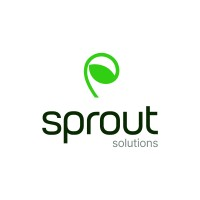

<!-- notes: This is the SECOND slide — you open on the awardees (honor the room), THEN introduce yourself here with the title gag. The subtitle now PLANTS the word "moat" — say it out loud here so it's seeded early; you'll pay it off mid-talk (slide ~14 asks it, the 7 principles spell M-O-A-T, Gino's close lands on it). THE TITLE GAG — and the fix for the audience: these are the TOP 10, medalists, listers. "Skill issue" as a roast would insult them. So flip it. Put "SKILL ISSUE?" up, let them brace for the roast, then the plot twist: "Not yours. Relax — I'm not here to roast the best students in the building. I HAD the medals too: silver medalist, cum laude, president's lister, just like a lot of you. Here's what nobody told me: the skill that wins the medal is NOT the skill that wins what comes next. That's the gap I want to talk about." This makes you a PEER (same résumé), turns the meme into a subverted-expectation laugh, and sets up the whole thesis: the medal isn't the moat. Threads straight into the moat slide later ("what's your edge?"). Honor their achievement first — they earned it — THEN raise the bar. -->

---

<!-- class: statement -->

# Hi. I'm Raymond. 👋

## And I used to sit *exactly* where you're sitting.

 
 
 
 

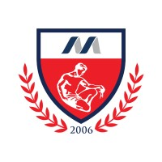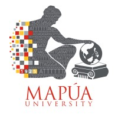

<!-- notes: Warm, simple open after the title gag — "Hi, I'm Raymond." Then the turn: I sat in those seats — same awards, same imposter feeling, a few years ahead of you. -->
<!-- class: statement -->

---

## My Background

# From your chair to here

#### Education
- 🎓 **BSECE** — Cum Laude & **Silver Medalist**, Mapúa Malayan Colleges Laguna
- 📜 **Board Exam → PRC Licensed**
- 📐 **MSECE — Control Systems**, Mapúa Intramuros **Student No. 2019390062**

#### Career
- 🔧 **Test Systems** then **Software & Tools Engineer**
- 🤖 **AI & Machine Learning Engineer** @ Sprout AI Labs today

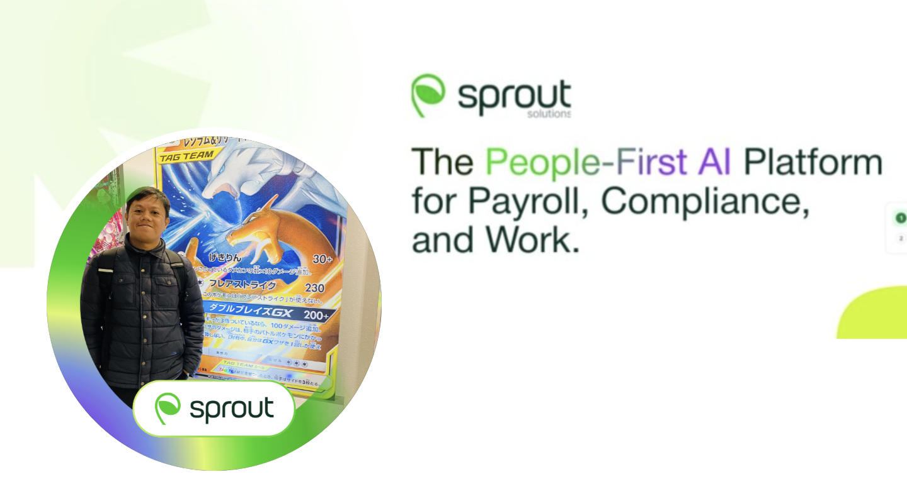

<!-- notes: FAST — six steps, don't dwell. The point is "the distance from your seat to mine is shorter than it feels." PRC Licensed = you did the board exam grind they're about to face. "Lab rat" then the soften ("not a rat, just someone in the lab") = the lovable self-deprecating laugh. The student number + Alumnus tag is a wink: "I'm literally still in the Mapúa system — I'm one of you, just a few years ahead." MSECE ties you to the grad students in the room. Next slide unpacks the actual journey. -->

---

## The gap nobody warns you about

# School → Board Exam → Your dream company

The scariest distance in engineering is the one **right after graduation**.

I crossed it. So will you.

<!-- notes: Name the fear — the academe-to-board-to-first-job gap. This is the distance ahead of them. Sets up the two mentors who got me across it: Medrano (next) then Tablante. -->

---

<!-- class: quote -->

## Don't give up
# *Pag nadapa, bumangon*
 
- **Engr. Anthony Hilmer S. Medrano**
- Executive Vice President & Chief Operating Officer, **Mapúa Malayan Colleges Laguna.**

 
 
- Our former Professor and ECE Program Chair

<!-- notes: PERSONAL CONTEXT — say it plainly: this is the advice Engr. Medrano gave US, his students, just WEEKS before our board exam. He was my professor AND the ECE Program Chair at the time. Today he's EVP & COO of Mapúa Malayan Colleges Laguna (OEVP, mcl.edu.ph/administrators). Full Taglish sincerity: "When you fall, just get up." Pause after — many of these kids have never failed and are terrified of it; this is permission to fall. Don't shortcut his title — say the whole thing, he earned it. -->

---

<!-- class: quote -->

## Submit, deliver, learn
# *Okay to start from the bottom (utusan)*

 
- **Engr. Dennis Tablante**
- Executive Vice President, **Mapúa Malayan Digital College.**
 
 
- Our former Professor & Dean of School of EE-ECE-CpE

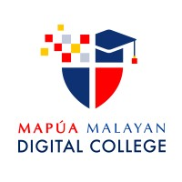

<!-- notes: PERSONAL CONTEXT — my own words, the lesson that stuck in my head — this is from a talk Dean Tablante gave when he was Dean of Engineering (he also became my professor). I keep coming back to it — it prepared me and steadied me whenever I look back on the early, humbling days of my career. Humility + execution beats complaining; the bottom is a launchpad, not a basement. Today he's EVP at Mapúa Malayan Digital College (linkedin.com/in/dennis-tablante-01830462). Don't shortcut his title. Leads straight into the journey images — "here's what 'start from the bottom' actually looked like for me." -->

---

<!-- class: brandslide -->

# Analog Devices

#### My first job — nearly **10 years**. Where it all began.

<!-- notes: WHERE IT BEGAN — pause here before the journey reel. Analog Devices was my first real job, and I stayed nearly a decade. This is the company that turned a fresh grad into an engineer. Say it warmly: everything in the next five images happened HERE — the cleaning, the repairs with no schematic, the test systems, the factory floor. One company, ten years, the full climb from the bottom. Then advance into the journey. -->

---

<!-- class: journey -->

  <figure class="jstep" data-step="1">
    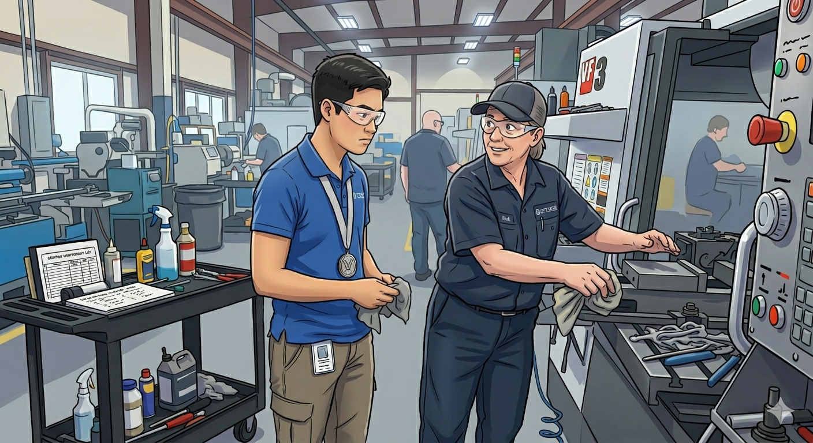
    <figcaption><b>1 · Junior Engineer</b> · <i>Analog Devices</i> — Day one. Cleaning, watching, learning the floor.</figcaption>
  </figure>
  <figure class="jstep" data-step="2">
    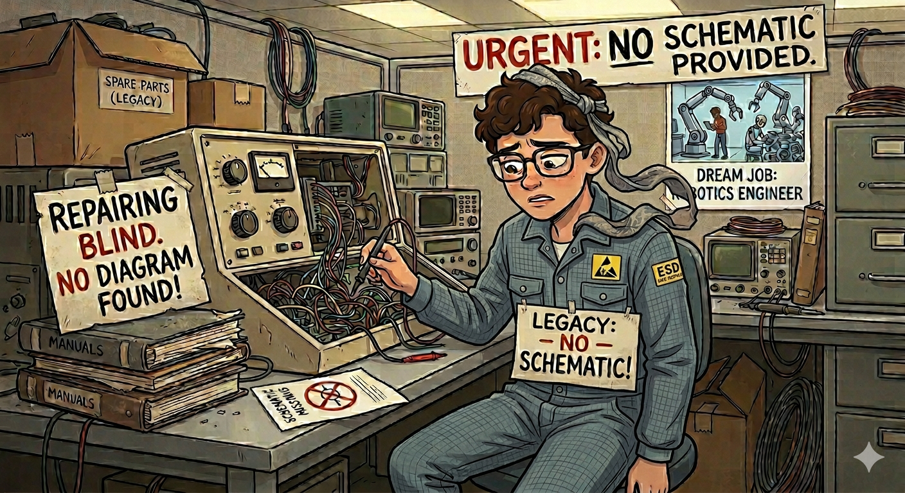
    <figcaption><b>2 · Repair, repair</b> — No schematic. No diagram. Figure it out anyway.</figcaption>
  </figure>
  <figure class="jstep" data-step="3">
    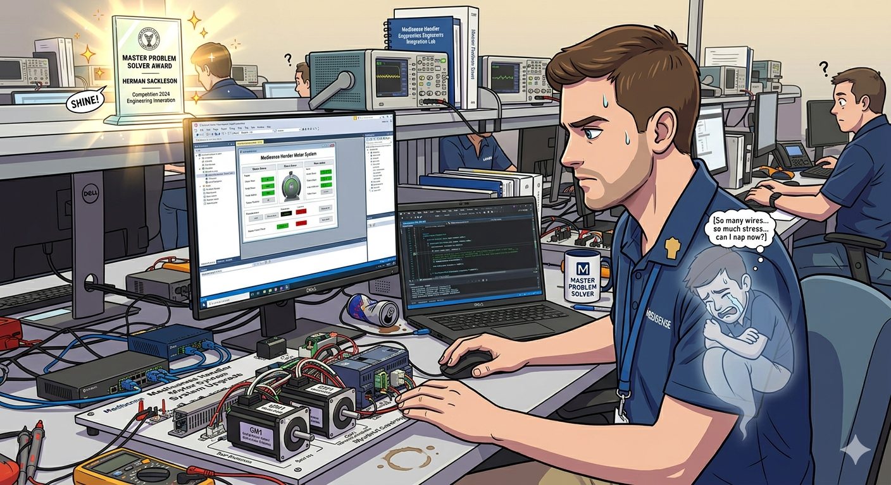
    <figcaption><b>3 · Test Systems &amp; Tools</b> — Debugging the undebuggable. <i>(Master Problem Solver.)</i></figcaption>
  </figure>
  <figure class="jstep" data-step="4">
    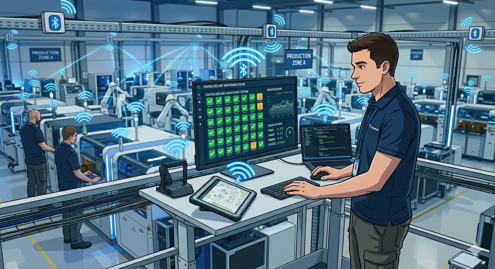
    <figcaption><b>4 · Embedded / IoT &amp; Control Systems</b> — Connecting the floor. Modernizing the system.</figcaption>
  </figure>
  <figure class="jstep" data-step="5">
    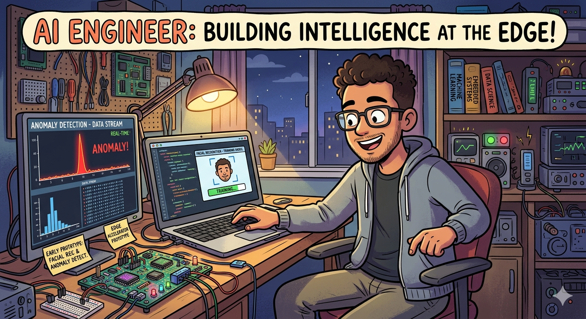
    <figcaption><b>5 · AI/ML Engineer</b> — Building intelligence at the edge. <i>Data &amp; AI · Agentic Systems.</i></figcaption>
  </figure>
  

<!-- notes: THE VISUAL JOURNEY — this is also the career arc (merged from the old text slide): Analog Devices Junior Test Engineer → repair → Test Systems & Software/Tools → Embedded/IoT & Control Systems (Factory Modernization) → AI/ML & Agentic Systems. Click → to reveal one image at a time, 1 through 5. Don't rush; narrate each: (1) "Day one — new guy cleaning equipment and watching, at Analog Devices." (2) "Repair gear with NO schematic — just figure it out." (3) "Test systems & tools — debugging the undebuggable; a problem-solver award and a LOT of stress." (4) "Embedded, IoT, control systems — modernizing a whole factory floor." (5) "And now — AI/ML engineer, building intelligence at the edge; Data & AI, agentic systems." Arrow advances images first; after image 5, → moves on. Land it: "Not one of these steps was wasted. The bottom built the top." (Note: 'Sprout AI Labs' intentionally removed from caption 5 per request — say the employer aloud if you wish, it's not on screen.) -->

---

<!-- class: section-dark -->

# The AI opportunity is clear.
## The challenge is us.

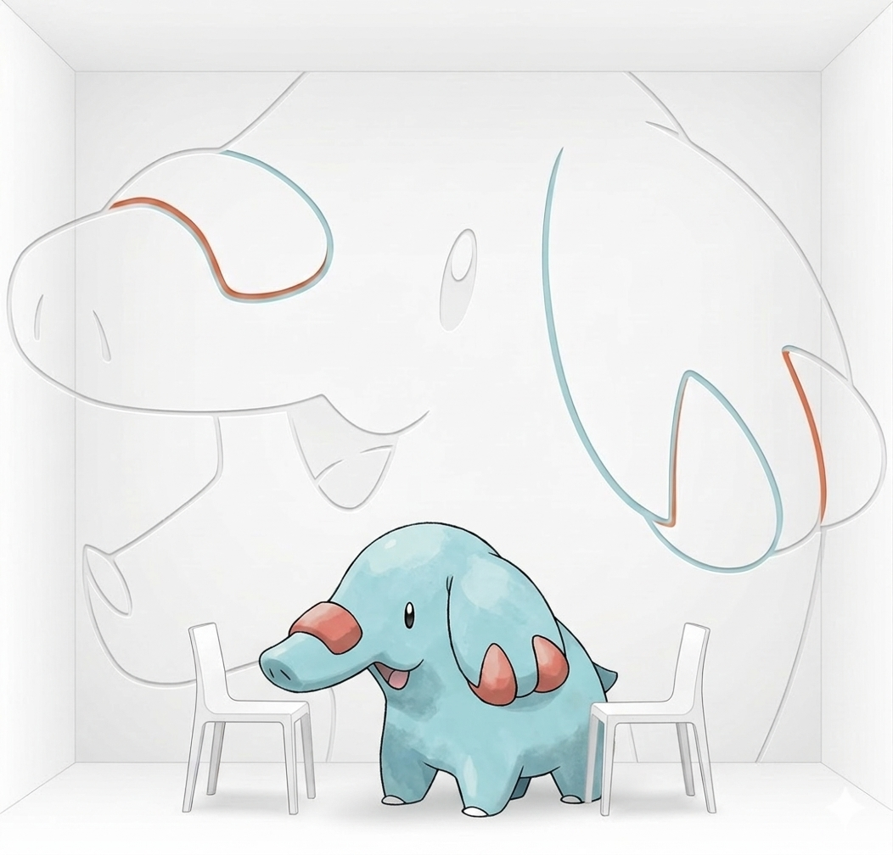

<!-- notes: Pivot from origin story (journey) to the AI present. Darker, calmer slide — a deliberate breath before the AI-fear section. Lower the energy here, then build it back up. -->

---

<!-- class: chartslide -->

## The trend before the fear

# Philippine attrition is climbing — every single year.

  
17.5%2023

  
19.1%2024

  
20%2025

Highest in **Southeast Asia.**

And **2 in 3** Filipino workers say they're eyeing the exit. 📉

<b>Source:</b> Aon Salary Increase &amp; Turnover Study, 2023–2025 (aon.com); PH workforce sentiment, Feb 2025.

<!-- notes: SOURCED — the year-over-year climb is the story, say it with confidence. Aon Salary Increase & Turnover Studies: PH attrition 17.5% (2023) → 19.1% (2024) → 20% projected (2025) — a clear, consistent rise, and the HIGHEST in SE Asia (ahead of Singapore 19.3%, Malaysia 18.2% in 2025; 700+ firms surveyed Jul–Sep 2025). The "2 in 3" = Aon's Feb 2025 release: ~64% of Filipino employees considering changing employers within 12 months. (If asked about 2022: ~18%, slightly softer attribution — lead with the 2023→2025 trend.) Backup, global: US BLS Jan 2024 median tenure 3.9 yrs (lowest since 2002); ages 25–34 just 2.7 yrs — YOUR cohort. The point: attrition + job-hopping was ALREADY the trend before AI — restlessness, title-chasing. AI lands on top of this instability, which is exactly why adaptability + DEPTH beats title-chasing. Connects to Principle 2: experience is gained, not bought. Sources: Aon Salary Increase & Turnover Studies + Feb 2025 PH workforce sentiment release (aon.com, 2023–2025); US BLS Employee Tenure news release (bls.gov, 2024). -->

---

<!-- class: newscards -->

## The fear

# "AI is going to take my job."

  
MAY 2026<b>Meta cuts 8,000 jobs</b>~10% of staff — an explicit AI pivot

  
2026<b>~16,000 roles</b>…while AWS grew 24%

  
2026<b>up to 30,000</b>~20% of the company

  
2026 TOTAL<b>≈148,000</b>tech jobs cut — about 975 a day

You spent 5 years learning to code. *Cool cool cool.* 😬

<b>Sources:</b> NPR &amp; CNBC (Meta, May 2026); WaPo (Amazon, Oracle); TechTimes / Yahoo Finance (2026 total ≈148k).

<!-- notes: SOURCED — these are real and recent, say them with weight. Meta: ~8,000 (≈10% of staff), May 20 2026, openly an AI restructuring — Zuckerberg memo: "success isn't a given in the AI era." Amazon: ~16,000 corporate roles cut in Q1 even as AWS grew 24% (its fastest in 13 quarters). Oracle: up to 30,000 (~20%), hitting legacy DBAs. Salesforce: 4,000 support roles, Benioff: "I need less heads." 2026 total ≈148,000 tech layoffs (~975/day). Voice the anxiety honestly — top students feel it MORE; they bet everything on being excellent at the old game. "Cool cool cool" is the laugh after the gut-punch. THE SETUP for the flip: same companies cutting are ALSO spending $725B on AI and sitting on ~275,000 OPEN AI roles. They're not hiring fewer people — they're hiring DIFFERENT skills. That's the pivot into "AI won't replace you; a person using AI will." Sources: NPR/CNBC/Yahoo Finance (Meta, May 2026); TechTimes/Yahoo (2026 totals ≈148k); WaPo/Invezz (Amazon, Oracle, Salesforce). -->

---

<!-- class: statement -->

# AI won't replace you.
## A person **using AI** will replace a person who **doesn't**.

 
 
 
 
 
 
- **John Nichols**
- Vice President, Maxim Integraded | Analog Devices

<!-- notes: New roles emerges! THE thesis. Say it slow, let it sit. SaaS isn't dead, coding isn't dead — the SDLC is becoming the AI-DLC. Old roles fade, new roles are born faster. -->

---

<!-- class: code -->

## Everyone can code now. Code is dispensable.

<pre class="bigcode">f = lambda: f()</pre>

# So what is your edge?

Your competitive advantage. Your differentiator. **Your moat.**

<!-- notes: THE moat slide — the hinge of the whole talk. First read the formula out loud for the non-coders / parents: "f equals lambda, f-of." It's a function whose only job is to call itself — infinite recursion, does nothing, returns nothing. The CpE/AIE kids get it instantly and laugh. Then the turn: when EVERYONE can generate code in seconds, the code itself is commodity — dispensable. Then hit the rhetorical TRIPLE, slow and deliberate, one beat each: "So what is your EDGE? … your competitive ADVANTAGE? … your DIFFERENTIATOR? … your MOAT?" DO NOT answer it. Let it hang. Pause. The whole back half of the talk — the 8 principles — IS the answer (domain expertise, judgment, understanding WHY, knowing what to build and whether it's right, being a teammate AI can't be). Plant the question here, harvest it slide by slide. ~45s. -->

---

## My actual biggest fear in 2026

# It's not AI taking my job.

# It's someone reading my **ChatGPT history.** 😅

<!-- notes: Comedy reset. Everyone has a cursed 2am prompt history — AI for better emails, grammar fixes, assignments, "make this sound smart." Big laugh, earned after the heavy stuff. Then turn serious: "but here's the part that actually scares me —" → next slide, the SECOND elephant. -->

---

<!-- class: section-dark -->

## The other elephant

# We're using AI without understanding the **why.**

Just to *finish.* Just for *compliance.* And the comprehension muscle quietly weakens.

  
MIT MEDIA LAB<b>83% couldn't quote their own essay</b>ChatGPT users showed the weakest brain connectivity — "cognitive debt"

  
RAND · DEC 2025<b>~7 in 10 students</b>say AI is eroding their critical thinking — yet usage jumped 48% → 62%

  
FACULTY · 2025<b>95%</b>fear students are over-relying on AI (AAC&amp;U / Elon)

<b>Sources:</b> MIT Media Lab, "Your Brain on ChatGPT" (2025); RAND American Youth Panel (Dec 2025); AAC&amp;U / Elon Imagining the Digital Future (Nov 2025); Microsoft Research (2025).

<!-- notes: THE SECOND ELEPHANT — the real danger isn't AI taking jobs, it's us outsourcing our THINKING. Frame it as a reality that follows them past graduation, into an AI-saturated workplace: people use AI just to finish, just for compliance — better emails, grammar, assignments, research — without understanding the WHY. Critical thinking and comprehension quietly atrophy. The data makes it undeniable: MIT Media Lab EEG study — ChatGPT users had the weakest brain connectivity ("cognitive debt"), and 83% couldn't quote a sentence from the essay they'd just "written" (vs 11% for non-AI). RAND (Dec 2025): ~70% of students themselves say AI is eroding their critical thinking — even as usage climbed 48%→62% in seven months. 95% of faculty fear overreliance. This is the SETUP for Principle 1 (Mastery: outsource the work, NEVER the understanding) and for the moat. Caveat for Q&A: the MIT study is preprint / small sample (54) — say "early signal," not "settled fact," if pressed. Deliver sober, not preachy: "AI didn't make us dumber. Using it without thinking did." -->

---

## The endless possibilities

# This shift is **inevitable** — so make it your **leverage.**

I built a working app in **minutes** — a Pokédex. A study buddy. A meme generator. A tutor that never sleeps.

Things that took my whole *thesis team* a semester.

The tools aren't going away.

The question is whether you **wield** them.

scan & try the Pokédex live

<!-- notes: REFRAMED — this is now the "inevitable shift = leverage" beat, the flip side of the two elephants before it. AI tools are endless and they're not going away — so the move isn't fear, it's LEVERAGE. The "app in minutes" beat: Pokédex, study buddy, meme gen — built fast, things that took a whole thesis team a semester. Then the live demo (Pokédex QR — audience scans & plays along). Land it: "the tools are inevitable; the only question is whether YOU wield them, or get wielded." Sets up the ladders / agentic-engineering slides next.

🔴 LIVE DEMO HERE — the Pokédex. Show it actually working: (1) search a Pokémon by name → it pulls it up. (2) take/upload a PHOTO of a Pokémon → it identifies it from the image. (3) THE FUNNY BIT: point the camera at YOURSELF — "let's see what Pokémon I am" → react to whatever it says, big laugh. Then land it: "I built this in minutes. No thesis team, no semester. That's the speed gap."

⚠️ Demo safety: have the app already open & tested before you walk on; pre-load on a phone/2nd tab so a projector hiccup doesn't kill it. If wifi/the demo fails, just SAY what it does and move on — the slide still works without it. Keep the whole demo under ~60–90s so it doesn't eat your 15 min. -->

---

## And the assistant in your pocket

# Einstein's IQ? *Legendarily* ~160.

## Your assistant is on call **24/7, for free, in every language.**

The question isn't *"is it smart?"* It's *"are you using it well?"*

*Einstein never took a modern IQ test — "160" is popular legend. The point stands: genius-level help is now in everyone's pocket.*

<!-- notes: Einstein-vs-AI beat. The genius isn't owning the smart tool — everyone has it now. The genius is HOW you direct it. Sets up the principles. -->

---

<!-- class: section-dark -->

# Two ladders every engineer is climbing right now.

<!-- notes: Transition into the transformation ladders — the meatiest industry content. -->

---

## Ladder 1 — how we manage work

# Waterfall → Agile

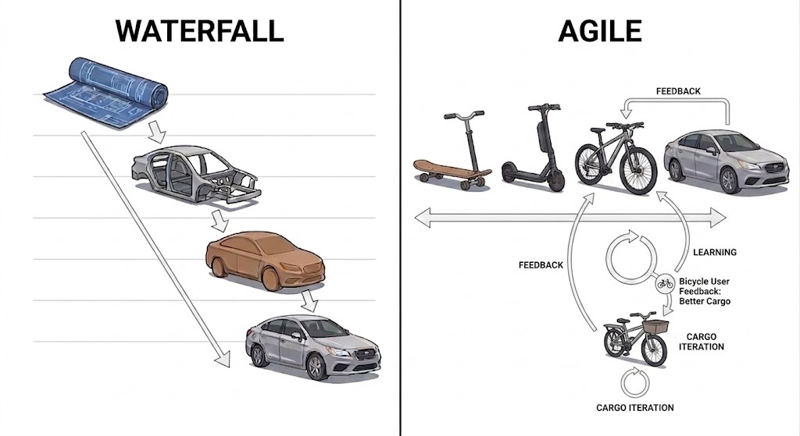

Each rung: **faster feedback, smaller batches, less waste.**

<!-- notes: Quick PM evolution — they may know these from class. Point: the trend is always toward tighter loops. Setup for ladder 2. -->

---

## Ladder 2 — how we use AI Assistant

# Chat → Autocomplete → Coding Agent → **Agentic Engineering**

When you graduate, you'll **start at the top rung.** Start practicing now.

<!-- notes: THE rung that matters. Chatbot (ask) → Co-pilot (suggests) → Vibe coding (drafts) → Agentic workflow (executes steps) → Agentic engineering (you architect systems of agents — what I do at Sprout). FRAMING: they're still STUDENTS — say "when you graduate you'll start here," not "you're already entering." The edge is that they can practice agentic tools NOW, in their projects and thesis, before they even leave school. That's the head start no previous batch had. -->

---

## Where the frontier is

# The labs are racing — and so is the whole world.

  

    
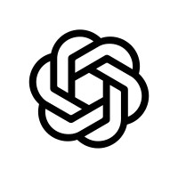 ChatGPT — weekly users

    

      
1MNov'22

      
100MAug'23

      
400MFeb'25

      
900MFeb'26

    

  

  

    
 Anthropic — annual revenue

    

      
~$0'22

      
$1BDec'24

      
$9BDec'25

      
$47BMay'26

    

  

From ChatGPT's launch to today.

New disciplines emerging just as fast: **AI Governance** · **Agentic Engineering** · *coding → domain expertise.*

<b>Sources:</b> OpenAI WAU figures via TechCrunch / OpenAI (2022–2026); Anthropic run-rate revenue via Sacra &amp; CNBC (May 2026).

<!-- notes: SOURCED growth — two hockey-sticks since ChatGPT launched (Nov 2022). LEFT = adoption: ChatGPT weekly active users 1M (5 days in) → 100M (Aug'23) → 400M (Feb'25) → 900M (Feb'26), per OpenAI. RIGHT = the money: Anthropic annual run-rate revenue ~$0 → $1B (Dec'24) → $9B (end'25) → $47B (May'26) — fastest revenue ramp in software history (Salesforce took ~20yrs to hit $30B; Anthropic did it in <3). Say it: "This isn't hype — it's the steepest adoption AND the steepest revenue curve software has ever seen. The world isn't asking IF; it's already paying." THEN the frontier point: it's not just bigger models — new disciplines (AI Governance, Agentic Engineering) are being born, and the job shifts from coding to domain expertise. That's where YOUR edge lives. Sources: OpenAI WAU reports (via TechCrunch/OpenAI, 2022–2026); Anthropic revenue (Sacra, CNBC, May 2026). -->
<!-- class: twincharts -->

---

## Why this is the moment

# Mathematicians say it might be the **best time in history to be alive.**

Ken Ono (Axiom Math): breakthroughs that took *careers* now take *months*.

You're not late. You're **early.** ⏱️

<b>Source:</b> Ken Ono — Axiom Math / public talks &amp; interviews on AI-accelerated discovery.

<!-- notes: Ken Ono / Axiom Math reference (YouTube: "Why This Is the Most Exciting Time to Be Human"). Frame against the doom. Discovery rate is exploding. "You're not late, you're early" — antidote to FOMO. -->

---

## Don't take it from me.

# The smartest minds in science agree.

  

    
<b>Terence Tao</b>Fields Medalist

    <ul><li>Verify — don't trust the output</li><li>Know the <b>why</b>, not just the prompt</li><li><b>Orchestrate</b> AI for the routine</li><li>Stay curious</li></ul>
  

  

    
<b>Sir Demis Hassabis</b>Nobel Prize 2024 · Google DeepMind

    <ul><li>The #1 skill: <b>"learning how to learn"</b></li><li>Adapt your tools</li><li>Validate results</li><li>Collaborate with AI</li></ul>
  

### Same answer. **Build your moat.**

<b>Sources:</b> Terence Tao, "Nobody Understands Why AI Actually Works" (youtu.be/ukpCHo5v-Gc); Demis Hassabis — Athens talk, Sept 2025 (deepmind.google).

<!-- notes: AUTHORITY / VALIDATION slide — third-party proof of your whole thesis from TWO people the Top 10 revere. (1) Terence Tao, Fields Medalist — "Nobody Understands Why AI Actually Works" (youtu.be/ukpCHo5v-Gc); his points: verify over rote output (37:12), foundational reasoning (24:05), orchestrate AI for long-tail (41:06), curiosity/basic science → breakthroughs like faster MRI (1:00:46). (2) Sir Demis Hassabis, CEO Google DeepMind, 2024 Nobel Prize in Chemistry for AlphaFold — Athens, Sept 14 2025: the most crucial skill for the next generation is "learning how to learn," teaching meta-skills (how to learn, adapt tools, validate results, collaborate with AI) over fixed curricula. SAY IT: "I've told you this for ten minutes — but don't take MY word for it. A Fields Medalist and a Nobel laureate from Google DeepMind just said the exact same thing." Both map onto MOAT: verify/know-why = MASTERY, orchestrate/collaborate = ORCHESTRATE, learn-how-to-learn = ADAPT. Then turn → next slide reveals M-O-A-T. -->
<!-- class: authority -->

---

<!-- class: section-dark -->

# 7 lessons. One word to remember them by.

## Build your **M.O.A.T.**

<!-- notes: Section divider — and the SETUP for the acronym. CRITICAL FRAMING: the audience are UNDERGRADS (batches 2022–2025, all year levels) — some graduating soon, many with years left. Do NOT call them "fresh grads." Frame as principles to start building NOW, while in school. Tee up the payoff: "Remember the question from earlier — code is cheap, what's your MOAT? Here it is, spelled out. Seven lessons, four letters." Each of the next slides adds a letter: M, M, O, O, O, A, T → assembled on the 'put it together' slide. Slow down through these — they're the screenshot slides. -->

---

<!-- class: principle -->

## M · Mastery

# Outsource thinking. Never outsource **understanding.**

Let AI do the work. *You* still have to know why the answer is right.

<!-- notes: MOAT letter 1 of 4 — M for MASTERY. #1 trap for smart students with great tools. Generating ≠ understanding. The engineer who can't explain their output is replaceable. Say: "M — Mastery. Outsource the typing, never the understanding." -->

---

<!-- class: principle -->

## M · Mastery

# Experience is **gained**, not bought.

Don't chase only titles and medals. (Says the guy with a silver medal. 🥈)

The achievement is the receipt — the experience is the meal.

<!-- notes: Still M — Mastery (the other half: you master through EXPERIENCE, not trophies). Self-aware joke about your own silver medal. CALLBACK to the title: "Remember 'the medal isn't the moat'? This is it. The medal is the RECEIPT — not the meal. You can't buy mastery with a GWA." -->

---

<!-- class: principle -->

## O · Orchestrate

# Be a practitioner — a **conductor**, not a one-man band.

You cannot solo. The best engineers orchestrate — people, tools, and now agents.

<!-- notes: MOAT letter 2 of 4 — O for ORCHESTRATE. The lone genius is a myth. You direct an orchestra of teammates and AI agents. "O — Orchestrate. You're the conductor now." -->

---

<!-- class: principle -->

## O · Orchestrate

# Be a good teammate.

You might be the best at one thing — but what wins is being a **teammate that cares.**

The kind people actually want to build with.

<!-- notes: Still O — Orchestrate. Can't orchestrate if no one will play with you. Talent without collaboration is a dead end. Land it warm: raw skill gets you in the room, but the teammate who genuinely CARES — about the work, about the people — is the one everyone wants to build with. That's the multiplier AI can't replace. -->

---

<!-- class: principle -->

## O · Orchestrate

# We're only as fast as our **slowest** team member.

And in the age of AI… that's the **humans.** 🐢

<!-- notes: Still O — Orchestrate. The bottleneck moved: machines are fast, WE are the latency now. A good conductor levels up the slowest player. Level up the humans, communicate faster, decide faster. -->

---

<!-- class: principle -->

## A · Adapt

# Reward systems are how we train AI.

Grades. Medals. Dean's List. **They trained you the same way.**

So ask: *am I optimizing for the score — or for what the score was supposed to measure?*

<!-- notes: MOAT letter 3 of 4 — A for ADAPT. THE one for this room. We train AI with rewards (RLHF); you were trained with rewards too — grades, awards, this ceremony. See the system you're being optimized by, and ADAPT — optimize for the craft, not the metric. End on the question. Let it breathe — the deepest beat. -->

---

<!-- class: principle -->

## T · Think right

# Right **thinking** produces right **acting.**

Your mental model comes first. Fix the thinking and the doing follows.

<!-- notes: MOAT letter 4 of 4 — T for THINK RIGHT. Clarity of thought precedes quality of action. Garbage model in → garbage decisions out. Applies to you AND to how you direct AI. "T — Think right. Get the model in your head right, and the doing follows." Next slide assembles the whole word. -->

---

<!-- class: section -->

## Put it all together

# M · O · A · T

### **M**astery · **O**rchestrate · **A**dapt · **T**hink right — *that's* your edge.

Code is cheap. Titles fade.

But a **MOAT** is yours — and no tool can take it.

So don't chase the title. **Become the engineer.**

<!-- notes: THE PAYOFF — assemble the acronym and CLOSE the loop from slide 14 ("code is dispensable… what's your moat?"). Reveal: M-O-A-T = Mastery, Orchestrate, Adapt, Think right. "Earlier I asked what your moat is. Here it is. Four letters. Spell it back to me in five years." This is also PREP FOR GINO — his line ("anchor to the discipline, not the tool") IS the MOAT. Land warm: while you grind in school, build your moat, not just your résumé. Then → the funny LinkedIn 'endgame' image, then your own bio. -->
<!-- class: moatslide -->

---

<!-- class: imageslide -->

## The end game (a real LinkedIn, btw)

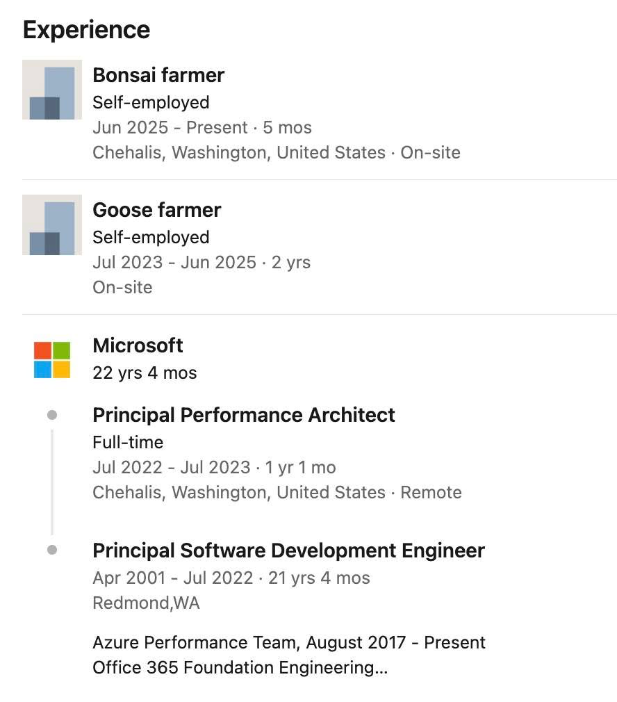

<!-- notes: THE GAG — let the image breathe, give them 3 seconds to read it, then react. This is a REAL LinkedIn: 22 years as a Microsoft Principal Engineer… then Goose farmer… then Bonsai farmer. Deliver it deadpan: "This is real. Twenty-two years, Principal Engineer at Microsoft. The endgame? Goose farmer. Then he leveled DOWN to bonsai." Big laugh. Then the turn: "Here's the thing — he got to decide that. Because he built the discipline first, he EARNED the right to define what 'success' means for HIM." Rolls straight into the next slide: your own bio (AI Engineer → goose farmer → Dad). The point: identity & meaning > title. Don't over-explain — the image does the work. -->

---

<!-- class: statement -->

# One day, write your own LinkedIn bio.

## Mine's headed somewhere weird.

<!-- notes: Pivot to the funny closing. Setup for the goose-farmer gag. -->

---

## My honest career trajectory

- ⚙️ Systems Engineer → 🤖 **Senior AI/ML Engineer** → AI Practitioner & Consultant → *maybe* **Principal / Director**
- 👨‍👧 a good husband… **Dad?**
- 📖 study the Bible — *(yes, get a diploma in theology)*
- 🪿 then… **farm owner**

# Envision the weird, wonderful thing you'll become.

<!-- notes: The honest, human trajectory. The career line climbs (Systems Engineer → Senior AI/ML → Practitioner/Consultant → maybe Principal/Director) — then the turn: the REAL goals aren't titles. Good husband, Dad, study theology (a literal diploma), farm owner. Deliver the career part fast, then slow down and grin on the human ones. The point: define success on YOUR terms, not the industry's. The theology + farm bits make it personal and disarming — they'll remember it. Big warm laugh, especially "farm owner." Sets up the next slides (evolve / mean-vs-significant / Gino). -->

---

<!-- class: statement -->

# Evolve. Expand. Or be **gone.**

## The half-life of a skill is shrinking. Stay curious or get left behind.

<!-- notes: Sharp, energizing. Not a threat — a dare. These are exactly the people who CAN evolve fastest. -->

---

## The choice

# Don't aim to be the **mean.**

# Aim to become **significant.**

The average is crowded. Significance is where the curve gets interesting. 📈

<!-- notes: Mean-vs-significant stats pun for engineers — average is crowded, significance is the tail where the world changes. They're already 2 sigma out — push further. Then pivot to thank-yous. -->

---

## Thank you, builders of this room

To the **EECE Student Council** & student leaders — **Kriz** (President) , **Travis** (OIC) & the whole team — *salamat* for putting on this celebration.

To the faculty & advisers who said *"bangon lang"* a hundred times.

<!-- notes: Thank organizers BY NAME — Kriz Kenshin Emerson Tam (President), Travis Joe Carlos (OIC/Secretary of Holistic Development). Honor the faculty/advisers (Engr. Chua, Sese, Yumang). -->

---

<!-- class: quote -->

# A word from my boss — and your Mapúan kuya

### "You were never trained to operate a tool. You were trained to solve problems — to make the call when the answer isn't obvious. That's the part no AI will ever replace. So don't anchor yourself to a tool. **Anchor yourself to the discipline.**"

**— Gino Oliver** · my boss at Sprout · **Mapúa MCL, Alpha batch** — the senior who walked this exact path first.

<!-- notes: THE Gino shout-out — and emphasize his identity HARD: Gino Oliver is (1) my CURRENT BOSS at Sprout, (2) a fellow Mapúan, (3) my SENIOR from the Alpha batch at Mapúa Malayan — he literally sat where you sit, a few years ahead of me. Living proof of the pipeline: Intramuros → industry → AI leadership, and now he leads. Read his FULL message aloud — this is the slide where you let his words land: "The tools kept changing — the methods, the materials, then the machines that think alongside us. And now the shift again: we're the ones building the systems those machines will operate in. But through every shift, one thing held. You were never trained to operate a tool. You were trained to solve problems, to exercise taste, to make the call when the answer isn't obvious. That's the part no AI will ever replace. So don't anchor yourself to a tool. Anchor yourself to the discipline." Then land the human point: in a field full of AI and tools, we forget — engineers are, at the core, PROBLEM-SOLVERS. That's the moat. That's the discipline. Tie it back to the title (the medal isn't the moat) and to the moat slide. -->

---

<!-- class: closing -->

## Let's connect.

# Learn. Evolve. Become significant. 🚀

#### *Congratulations, EECE. Now go build something significant.*

linkedin.com/in/raymond-cruzin

  
Focus on what you are <strong>becoming</strong>. Be a good engineer.

  <blockquote class="verse">
    "And the things you have heard me say in the presence of many witnesses entrust to reliable people who will also be qualified to teach others."
    <cite>— 2 Timothy 2:2 (NIV)</cite>
  </blockquote>

<!-- notes: Land the plane. Drop your LinkedIn QR PNG in place of the dashed box: . Recap the three taglines, then the final charge — "Focus on what you are BECOMING. Be a good engineer." Close with 2 Timothy 2:2: the whole talk is about a senior entrusting what he learned to the next generation, who will pass it on again — that's the verse made literal. Let it sit, then step back for the Token of Appreciation. -->
